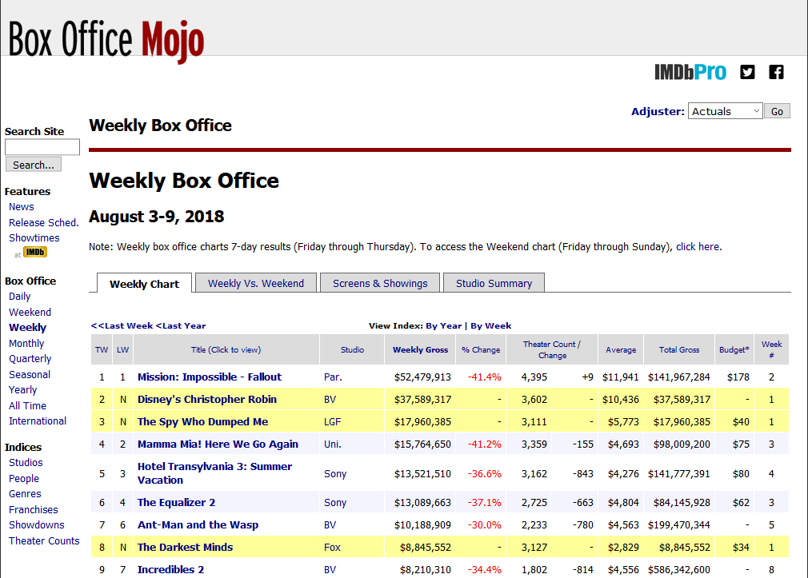
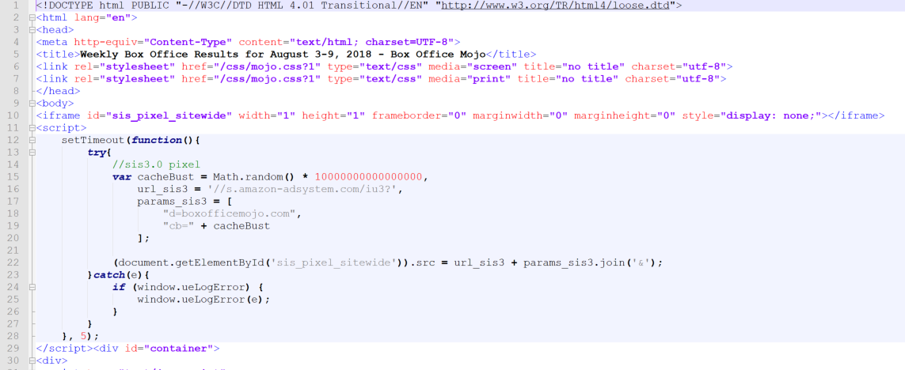

```{r setup, include=FALSE}

library(httr)

library(rvest)

library(dplyr)

library(magrittr)

library(lubridate)

knitr::opts_chunk$set(echo = TRUE)
```

## Introduction

Web scraping involves using a set of automated tools to copy information from a website rather than doing it manually (Vargiu & Urru 2012).  Due to the volume, types and inconsistent formats of information available on the Web, Web scraping provides an effective way to extract large amounts of data quickly for further analysis. For this reason, it is also an efficient method often preferred by researchers (Krotov & Silva 2018). 


Before we get started, there are legal and ethical implications of Web scraping to be aware of. Krotov & Silva (2018) comment that there are no direct laws preventing Web scraping at this point in time however it is still guided by an existing legal framework of copyright infringement, fraud, abuse and breach of contract.  Some common examples include:

+ Terms of use - Websites may prohibit Web scraping through their 'terms of use' policy and failure to comply would be deemed as breach of contract. However, to violate the contract, the person must accept the terms. 

+	Copyright - Extracting and republishing the exact data 'owned' by the Website could be subject to copyright. This does not include comments from users using the website. It would also be possible to extract and summarise the information without breaching copyright.  

+ Fraud - Accessing data that is for illegal or fraudulent purposes. 

+ Abuse - The web scraping method causes damage to the Website. 


Ethically, there are also individual and organisational privacy and unfair use areas to consider (Krotov & Silva 2018). As each specific reason for Web scraping may differ, it is important to review the legal risks in your area before proceeding. 

## Objective

This guide aims to demonstrate how to extract data from a website through R by using the httr and rvest packages. As an example we will extract weekly movie sales from the boxofficemojo.com website (IMDB 2018). 
 
The boxofficemojo.com website is owned by IMDB and reports on United States box office sales for movies. For this guide, our goal will be to extracting weekly sales from this URL [https://www.boxofficemojo.com/weekly/chart/?yr=2018&wk=31&p=.htm](https://www.boxofficemojo.com/weekly/chart/?yr=2018&wk=31&p=.htm) and store it in a data frame to allow further analysis.

Figure 1 – Weekly Box Office results (IMDB 2018B): 

Firstly we'll add the packages we need:


```{r eval=FALSE}

install.packages("httr")
library(httr)

install.packages("rvest")
library(rvest)

install.packages("dplyr")
library(dplyr)

install.packages("magrittr")
library(magrittr)

install.packages("lubridate")
library(lubridate)

install.packages("lubridate")
library(lubridate)

```

We will use the httr package to build the query. Notice how in the URL [https://www.boxofficemojo.com/weekly/chart/?yr=2018&wk=31&p=.htm](https://www.boxofficemojo.com/weekly/chart/?yr=2018&wk=31&p=.htm) there is a 'yr' and 'wk' parameter. This refers to the year and calendar week. It is possible to change the week number in the URL to see different week results without having to click on a different hyperlink. Try changing it.
 
Having the ability to adjust the parameter means the query can automatically be generated and return different weekly results. The Httr package provides the ability to call a URL via the GET() function and pass a series of parameters. 


```{r eval=TRUE}
getYear = "2018"
getWeek = "31"

base_url = "https://www.boxofficemojo.com/weekly/chart/"
query_params = list(yr=getYear, wk=getWeek)

resp = GET(url=base_url, query=query_params)

resp
```

Notice the status 200. This means we received a successful response back. If you get a status of 4XX it means a problem on the website. If you get a status of 5XX it means a problem on your side.

Now that we have the response (resp) back from the Website, we can extract the contents by using the read_html() function in the rvest package. 

```{r eval=TRUE}
page_html = read_html(resp)

```

We can write the contents to file to read the contents and find out what to extract. 

```{r eval=FALSE}
write_xml(page_html, file="WeeklyBoxOfficeSales.html")

```
Here's what the content looks like. 

Figure 2 – HTML contents of webpage: 

HTML consists of a series of text within tags eg. &lt;title&gt;Weekly Box Office Results&lt;/title&gt;

In rvest, each tag is considered a node. A node can be extracted as a object using the html_nodes() function passing the name of the node. For example, calling html_nodes("title") will return all nodes called '&lt;title&gt;' to a list. To extract the actual title, the html_text(<node>) function can be used. 
For example, to get the title of the page we can do the following:  

```{r eval=TRUE}
page_html %>% 
  html_nodes("title") %>%
  html_text()

```

Our objective is to get the table from the Webpage into a data frame. This can be done in a series of steps.

1. Calling html_nodes("table") extracts all the tables in the html document. Notice how there are several tables returned. You will need to find which table has the content you are after. 

```{r eval=TRUE}
page_html %>%
  html_nodes("table")

```

2.	In our case, the data we need is in table 5. This can be specifically extracted from the list using the magrittr::extract2() function. You can see that the 1 table is returned with the rows and columns we need.

```{r eval=TRUE}
page_html %>%
  html_nodes("table") %>%
  extract2(5) 

```

3.	The html_table() function converts the HTML table to a more useful data frame, however we are not quite done yet.

```{r eval=TRUE, results='asis'}
mydf = page_html %>%
  html_nodes("table") %>%
  extract2(5) %>% 
  html_table()

```
```{r eval=TRUE, echo=FALSE}
library(knitr)

kable(head(mydf, 5))
```

4. We can use setNames() to name the columns of our data frame.

```{r eval=TRUE}

myColNames = c("ThisWeek", "LastWeek", "Title", "Studio", "WeeklyGross", "PctChange", "TheatreCount", "TheatreChange", "Average", "TotalGross", "Budget", "WeekNum")

mydf = page_html %>%
  html_nodes("table") %>%
  extract2(5) %>% 
  html_table() %>%
  setNames(myColNames)

```
```{r eval=TRUE, echo=FALSE}
library(knitr)

kable(head(mydf, 4), caption="first 4 lines")

kable(tail(mydf, 4), caption="last 4 lines")
```

5. Notice how the first row contains the column names and the last row has totals. We can filter this out by filter(row_number()!=1) and filter(row_number()!=n())

```{r}
mydf = page_html %>%
  html_nodes("table") %>%
  extract2(5) %>% 
  html_table() %>%
  setNames(myColNames) %>%
  filter(row_number()!=1) %>% 
  filter(row_number()!=n())

```
```{r eval=TRUE, echo=FALSE}
library(knitr)

kable(head(mydf, 4), caption="first 4 lines")

kable(tail(mydf, 4), caption="last 4 lines")
```

6. That's better. We should also add to the data frame what year and week we requested using mutate(calYear=getYear, calWeek=getWeek).

```{r}
mydf = page_html %>%
  html_nodes("table") %>%
  extract2(5) %>% 
  html_table() %>%
  setNames(myColNames) %>%
  filter(row_number()!=1) %>% 
  filter(row_number()!=n()) %>%
  mutate(calYear=getYear, calWeek=getWeek)

```
```{r eval=TRUE, echo=FALSE}
library(knitr)

kable(head(mydf, 2))

```

7. Brilliant. Now to make it a little more robust. What happens if you specify a week where there are no results, you need a way to stop the code from erroring. The tryCatch method catches errors gracefully and allows you to return a value if it errors. We will return a NULL value if it errors. 

```{r eval=FALSE}

  tryCatch(
    {
      page_html %>%
        html_nodes("table") %>%
        extract2(5) %>% 
        html_table() %>%
        setNames(myColNames) %>%
        filter(row_number()!=1) %>% 
        filter(row_number()!=n()) %>%
        mutate(calYear=getYear, calWeek=getWeek)
    }
    ,
    error=function(e) return(NULL)
  )

```

8. Almost there. Now we can turn this into a function, passing the year and week to get a dataframe of results easier. 

```{r eval=TRUE}
getWeeklyBoxOffice = function(theYear, theWeek) {
  
  if (theYear <= year(now()) && theWeek <= week(now())-2) {
  
    tryCatch(
      {  
        base_url = "https://www.boxofficemojo.com/weekly/chart/"
        query_params = list(yr=theYear, wk=theWeek)
        
        myResp = GET(url = base_url, query=query_params)
        
        myPage_html = read_html(myResp)
        
        myColNames = c("ThisWeek", "LastWeek", "Title", "Studio", "WeeklyGross", "PctChange", "TheatreCount", "TheatreChange", "Average", "TotalGross", "Budget", "WeekNum")
        
          myWeeklyBoxOffice = myPage_html %>%
          html_nodes("table") %>%
          extract2(5) %>%
          html_table() %>%
          setNames(myColNames) %>%
          filter(row_number()!=1) %>% 
          filter(row_number()!=n()) %>%
          mutate(calYear=theYear, calWeek=theWeek)
        
          return(myWeeklyBoxOffice)
      },
          error=function(e) return(NULL)
    )
  }
  else {
    return(NULL) 
  }
}
         
df1 = getWeeklyBoxOffice("2018", "31")
df2 = getWeeklyBoxOffice("2018", "30")
```
```{r eval=TRUE, echo=FALSE}
library(knitr)

kable(head(df1, 2), caption="week 31 results")
kable(head(df2, 2), caption="week 30 results")

```

9. Lastly, we can do even better. The previous step was great for one week at a time. What if we want to get all the sales from a couple of months in arrears? 
 
We can create another function that passes a date, works out all the weeks in between to today and calls the same getWeeklyBoxOffice() function. 

```{r eval=FALSE}

getWeeklyBoxOfficeByDate = function(startDate) {
  
  countWeeks = floor(interval(startDate, now()) / duration(num=1, units="weeks"))
  
  weekDates = ymd(startDate) + weeks(x = seq.int(from = 0, to = countWeeks, by = 1))
  
  yearWeeks = data.frame(yr=year(weekDates), wk=week(weekDates))
  
  mydf = NULL
  fulldf = NULL
  for (x in 1:nrow(yearWeeks)) {
    myYear = yearWeeks[x,1]
    myWeek = yearWeeks[x,2]
    
    mydf = getWeeklyBoxOffice(myYear, myWeek)
    if(!is.null(mydf)) {
      if(!is.null(fulldf)) {
        fulldf = rbind(fulldf, mydf)  
      } else {
        fulldf = mydf
      }
      
    }
  }
  return(fulldf)  

}

fulldf = getWeeklyBoxOfficeByDate("2018-07-19")

```

Now that we have a data frame with many weekly results we can apply further exploratory data analysis and plotting to analyse the results. 

## References

IMDB 2018A, *Box Office Mojo*, viewed 14 August 2018, &lt;[https://www.boxofficemojo.com](https://www.boxofficemojo.com)&gt;.


IMDB 2018B, *Weekly Box Office*, Box Office Mojo, viewed 14 August 2018, &lt;[https://www.boxofficemojo.com/weekly/chart/?yr=2018&wk=31&p=.htm](https://www.boxofficemojo.com/weekly/chart/?yr=2018&wk=31&p=.htm)&gt;


Krotov, V. & Silva, L. 2018, 'Legality and Ethics of Web Scraping', *Twenty-fourth Americas Conference on Information Systems.*


Vargiu, E. & Urru, M. 2012, 'Exploiting web scraping in a collaborative filtering- based approach to web advertising', *Artificial Intelligence Research*, vol. 2, no. 1, p. 44, viewed 14 August 2018, &lt;[http://www.sciedu.ca/journal/index.php/air/article/view/1390](http://www.sciedu.ca/journal/index.php/air/article/view/1390)&gt;.

